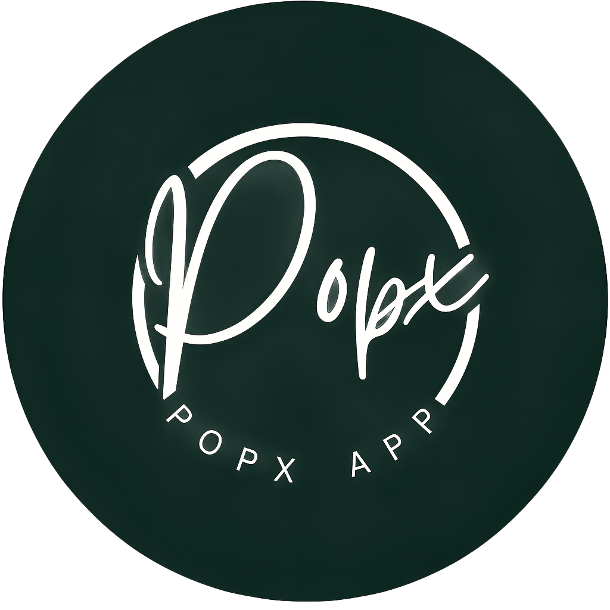

🌟 Popx App – Login & Signup System

A modern React.js application with Login & Signup pages, designed with a clean UI, responsive layout, and branding using the Popx logo. This project is a starting point for authentication-based apps.

🚀 Features

✅ Login Page 
✅ Signup Page
✅ Responsive UI (works on desktop & mobile)
✅ Material Symbols for clean icons
✅ Google Fonts – Inter for modern typography
✅ Reusable components for scalability

🛠️ Tech Stack

Frontend: React.js, TailwindCSS (or custom CSS if you used it)

Icons: Google Material Symbols

Fonts: Google Fonts (Inter)

Version Control: Git & GitHub

📂 Project Structure
Popx-App/
│── public/
│   ├── index.html        # Entry HTML
│   ├── mainlogo.png      # App logo
│── src/
│   ├── components/       # Reusable components
│   ├── pages/            # Login & Signup pages
│   ├── App.js            # Root component
│   ├── index.js          # Entry point
│── package.json
│── README.md

⚡ Getting Started
1️⃣ Clone the repository
git clone https://github.com/your-username/popx-app.git
cd popx-app

2️⃣ Install dependencies
npm install

3️⃣ Run the development server
npm start

Your app will be live at 👉 http://localhost:3000

🔐 Login Page
📝 Signup Page

🎨 Branding

This project uses the Popx Logo:

deploy link : https://popx-app-assignment.vercel.app/

